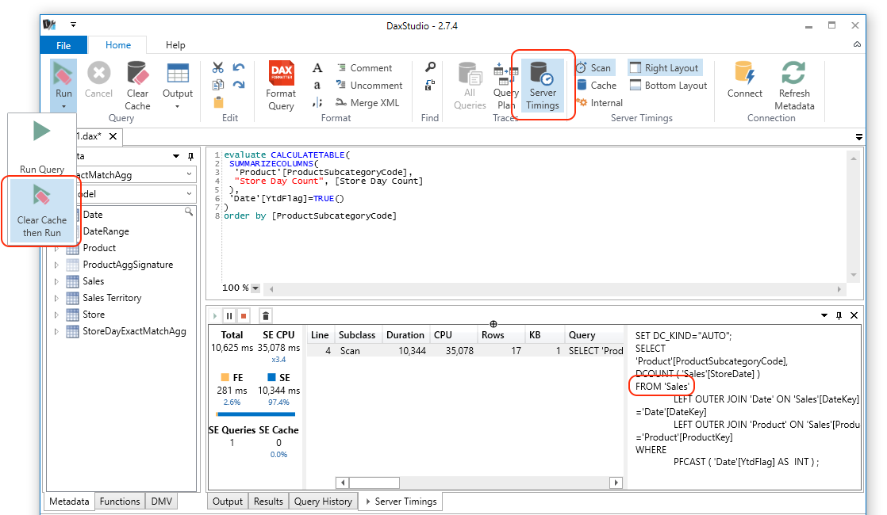

# Exact Match Agg Sample

This Github repo is under construction. Stay tuned.

Greg Galloway blogged about a way to improve SSAS Tabular distinct count performance by an order of magnitude by creating exact match aggregations. This Github repo contains the code samples mentioned along with instructions to deploy the sample solution to Azure SQL DW and Azure Analysis Services.

### Deployment Option 1 - Just Restore SSAS Model

If you are not interested in creating an Azure SQL DW and creating the tables and processing the SSAS Tabular model yourself, then you can just restore a backup of the Tabular model.

1. Create an Azure Analysis Services server. It should be performance tier S1 (must be Standard because of partitioning and needs at least 25GB of RAM). And you need to specify the backup storage account:

1. Download the [ExactMatchAgg.Azure.AS.Backup.zip](https://github.com/furmangg/exact-match-agg/releases/download/ssas-backup/ExactMatchAgg.Azure.AS.Backup.zip) file, unzip it, then upload ExactMatchAgg.abf to your Azure storage account which you have configured your Azure Analysis Services server to use for backups.

1. [Restore](https://docs.microsoft.com/en-us/azure/analysis-services/analysis-services-backup#restore) the backup to create a new ExactMatchAgg database in Azure Analysis Services.

### Deployment Option 2 - Create Azure SQL DW and Deploy SSAS Model

1. Create a new Azure SQL DW setting the source as the AdventureWorksDW sample. Choose Gen2 DW200c performance level.
   

1. Download a [.zip of the source code](https://github.com/furmangg/exact-match-agg/archive/master.zip). Unzip this file.

1. Execute "[SQL/01 create tables in Azure DW.sql](https://raw.githubusercontent.com/furmangg/exact-match-agg/master/SQL/01%20create%20tables%20in%20Azure%20DW.sql)" in SSMS against the DW. This script simply takes the existing AdventureWorksDW tables and creates a few new tables from it that are fairly large (400 million rows) in order to demonstrate the distinct count performance problem in SSAS. The only code in this script which is specific to the exact match aggs implementation is the ExponentModProductKey column in vwDimProduct.

1. Execute "[SQL/02 create exact match agg tables.sql](https://raw.githubusercontent.com/furmangg/exact-match-agg/master/SQL/02%20create%20exact%20match%20agg%20tables.sql)" in SSMS against the DW. These are the tables used in the exact match aggs implementation that Greg described in his blog post. Review the comments in this script for more insight into specific implementation details about the code.

1. Execute "[SQL/03 usp_ProductAggSignatureForDateRange.sql](https://raw.githubusercontent.com/furmangg/exact-match-agg/master/SQL/03%20usp_ProductAggSignatureForDateRange.sql)" in SSMS against the DW. This sproc is used in the partition queries for the new exact match agg table. We decided to create the pre-aggregations via this sproc at cube processing time because each date range can be calculated in parallel during cube processing. It is possible to add this logic to the ETL and persist this exact match agg table if you prefer that implementation.

1. Create an Azure Analysis Services server. It should be performance tier S1 (must be Standard because of partitioning and needs at least 25GB of RAM). (Alternately you could use an Analysis Services 2017 Tabular server with at least 25GB of free RAM.)

1. Open the SSAS/ExactMatchAgg.sln solution in Visual Studio 2017 with [SSDT](https://docs.microsoft.com/en-us/sql/ssdt/download-sql-server-data-tools-ssdt) installed. 

1. In the Tabular Model Explorer pane, expand the Data Sources folder and double click ExactMatchAggDW to edit the connection string. Set your connection string to point to the DW you created above and click Save.

1. Go to the Solution Explorer pane, right click on the ExactMatchAgg node at the top (the project, not the solution) and choose Properties. Set Processing Option to Full, set Server to the SSAS server you wish to deploy it to. If you're deploying to Azure Analysis Services, then the server name should be in the format asazure://&lt;region&gt;.asazure.windows.net/&lt;yourserver&gt; and click OK then right click on the ExactMatchAgg project node and choose Deploy.

### Testing Query Performance

1. Open the "[SSAS Tests/performance tests.msdax](https://raw.githubusercontent.com/furmangg/exact-match-agg/master/SSAS%20Tests/performance%20tests.msdax)" file in SSMS, run the ClearCache XMLA statement before each query in the file to test the performance.

1. The easiest way to monitor whether your query is missing the agg or not is to use [DAX Studio](http://daxstudio.org/) to monitor the Vertipaq scans and see if it is performing a distinct count on the main table. Connect to Azure Analysis Services and change to the right database. Click the Server Timings button. Change the Run button to clear the cache before each query. Then run the query and look through each scan to see if it's doing a "DCOUNT" on the Sales table.

Another option is to use Profiler and capture the "VertiPaq SE Query End" event and the ObjectPath column. If you see any vertiscans with ObjectPath ExactMatchAgg.Model.Sales then you can study the scan further to see if it's a "DCOUNT".

1. There is also a "Have Exact Pre-aggregation" measure in the model which returns whether the current filter context is pre-aggregated. This is also another way to get a quick indication during debugging of whether we're hitting an agg.

### Questions, Problems or Improvements?

If you have issues or questions create an issue [here](https://github.com/furmangg/exact-match-agg/issues).

If you have ideas on how to improve the solution to make it perform better please start a thread on the [Issues tab](https://github.com/furmangg/exact-match-agg/issues).

