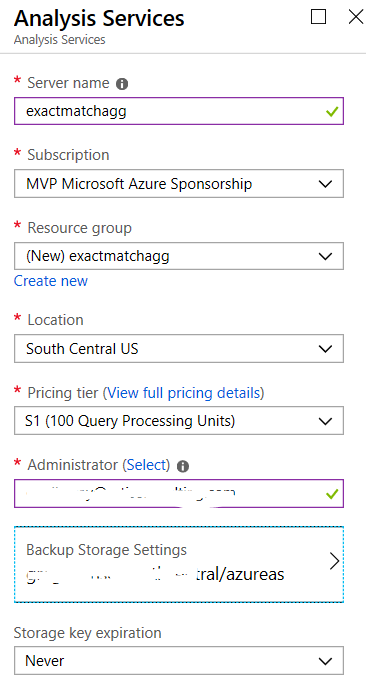
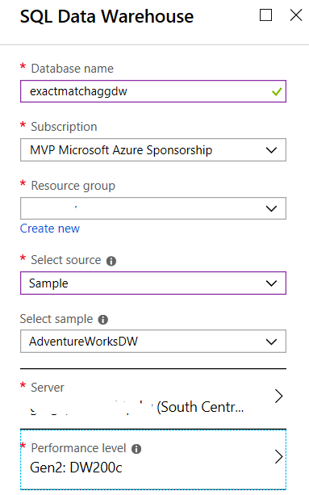

# Exact Match Agg Sample

This Github repo is under construction. Stay tuned.

Greg Galloway blogged about a way to improve SSAS Tabular distinct count performance by an order of magnitude by creating exact match aggregations. This Github repo contains the code samples mentioned along with instructions to deploy the sample solution to Azure SQL DW and Azure Analysis Services.

### Deployment Option 1 - Just Restore SSAS Model

If you are not interested in creating an Azure SQL DW and creating the tables and processing the SSAS Tabular model yourself, then you can just restore a backup of the Tabular model.

1. Create an Azure Analysis Services server. It should be performance tier S1 (must be Standard because of partitioning and needs at least 25GB of RAM). And you need to specify the backup storage account:

1. Download the ExactMatchAgg.abf backup file upload it to your Azure storage account which you have configured your Azure Analysis Services server to use for backups.

1. [Restore](https://docs.microsoft.com/en-us/azure/analysis-services/analysis-services-backup#restore) the backup to create a new ExactMatchAgg database in Azure Analysis Services.

### Deployment Option 2 - Create Azure SQL DW and Deploy SSAS Model

1. Create a new Azure SQL DW setting the source as the AdventureWorksDW sample. Choose Gen2 DW200c performance level.
   

1. Download a .zip of the source code from this repo from the "Clone or download" green button in the top right of the page. Unzip this file.

1. Execute "SQL/01 create tables in Azure DW.sql" in SSMS against the DW

1. Execute "SQL/02 create exact match agg tables.sql" in SSMS against the DW

1. Execute "SQL/03 usp_ProductAggSignatureForDateRange.sql" in SSMS against the DW

1. Create an Azure Analysis Services server. It should be performance tier S1 (must be Standard because of partitioning and needs at least 25GB of RAM). (Alternately you could use an Analysis Services 2017 Tabular server with at least 25GB of free RAM.)

1. Open the SSAS/ExactMatchAgg.sln solution in Visual Studio 2017 with [SSDT](https://docs.microsoft.com/en-us/sql/ssdt/download-sql-server-data-tools-ssdt) installed. 

1. In the Tabular Model Explorer pane, expand the Data Sources folder and double click ExactMatchAggDW to edit the connection string. Set your connection string to point to the DW you created above and click Save.

1. Go to the Solution Explorer pane, right click on the ExactMatchAgg node at the top (the project, not the solution) and choose Properties. Set Processing Option to Full, set Server to the SSAS server you wish to deploy it to. If you're deploying to Azure Analysis Services, then the server name should be in the format asazure://&lt;region&gt;.asazure.windows.net/&lt;yourserver&gt; and click OK then right click on the ExactMatchAgg project node and choose Deploy.